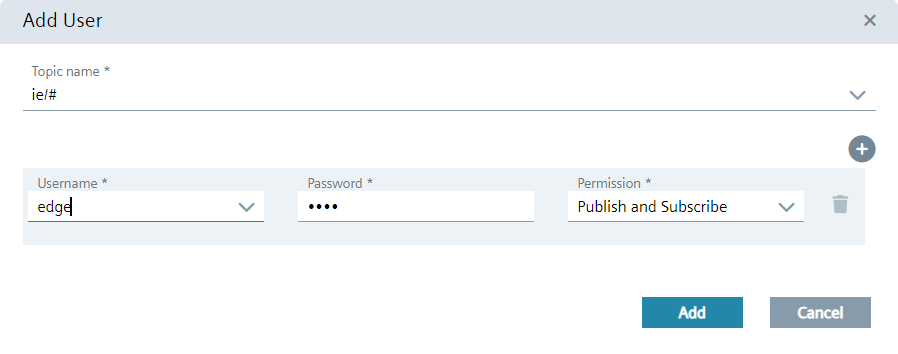
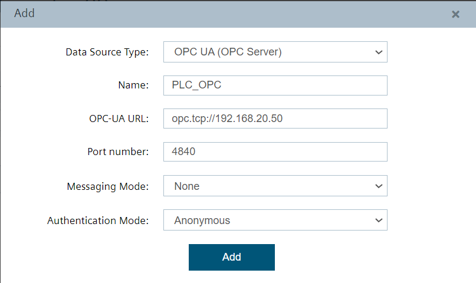
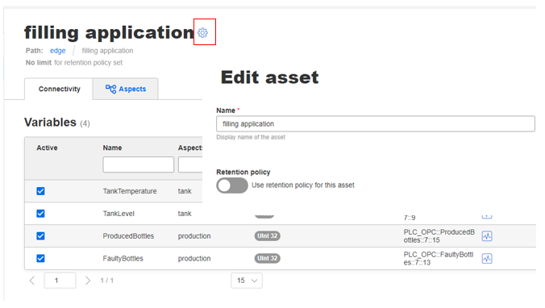

# Configuration

- [Configuration](#configuration)
  - [Configure PLC Connection](#configure-plc-connection)
    - [Configure Databus](#configure-databus)
    - [Configure OPC UA Connector](#configure-opc-ua-connector)
  - [Configure Data Service](#configure-data-service)
    - [Configure the adapter](#configure-the-adapter)
    - [Configure an asset with variables](#configure-an-asset-with-variables)
    - [Configure an aspect](#configure-an-aspect)

## Configure PLC Connection

To read data from the PLC and provide the data, we will use OPC UA Connector to establish connection with the PLC via OPC UA.
The OPC UA Connector sends the data to the Databus, where the Data Service app can collect what is needed.
In order to build this infrastructure, these apps must be configured properly:

- Databus
- OPC UA Connector

### Configure Databus

In your IEM open the Databus and launch the configurator.

Add a user with this topic:
`"ie/#"`

Deploy the configuration.

### Configure OPC UA Connector

In your IEM open the OPC UA Connector and launch the configurator.

Add a data source:

Add needed tags:

Edit the settings:

Hint: Username and password should be the same for all system apps, e.g. "edge" / "edge".

Hint: V1.2 only supports "bulk publish".

Deploy and start the project.

## Configure Data Service

In your IED Web UI open the app Data Service.

### Configure the adapter

Click the icon "Connectors" on the left bar. The Data Service provides adapters for the following connectors:

- Ethernet IP Connector (MQTT)
- Modbus TCP Connector (MQTT)
- OPC UA Connector(MQTT)
- Profinet IO Connector (MQTT)
- SIMATIC S7 Connector (MQTT)
- Hmi Runtime (Open Pipe Path)
- System Info (MQTT)

The adapter **"System Info"** is predefined and offers different variables, e.g. TotalHeapSize, TotalAvailableSize, UsedHeapSize, WriteQueueLength, WriteQueueValueCount, WriteSpeed, WriteInsertCount, WriteRequestCount, DatabaseSize. It is also possible to add a **self-developed** adapters by choosing the "plus" icon. This adapter must be based on the MQTT protocol.

To connect to an adapter choose the adapter you want to use. Click the edit icon on the right to open the adapter configuration. The Broker URL should be prefilled with `"tcp://ie-databus:1883"`. Deactivate the field `Use databus settings` and add the missing entries for username and password (again "edge"/"edge"). Make sure to check the box for password to enable inputting the password in the textbox. Set the status to 'Active' and save your configuration.

The adapter (here SIMATIC S7 Connector) should now be activated and connected to the Data Service.

### Configure an asset with variables

An asset is a digital representation of a machine or automation system with one or more automation units (e.g. PLC). The data that describes an asset is collected and transferred. The data is then made available for further processing and evaluation.

On the left bar click the icon "Assets & Connectivity". For the "edge" asset you can add child assets as needed. Click "Create first variable" or "Add variable" / "Add multiple variables" on the right side to add one or more tags. Choose an proper adapter that is activated and select a tag provided by that adapter.

Using the **variables preview**, you can immediately check whether data is transmitted from the Databus:

The **data storage period** can be set individually for each asset. The data is deleted from the memory after this time.
To change the this time period, klick on the link below the asset:

### Configure an aspect

An aspect is a mechanism for data modeling of assets. Aspects group related data points (topics) based on their logical assignment.

Choose the register "Aspects" to create a new aspect by clicking "Create first aspect" or "Add aspect".

Hint: An aspect can include several variables, but each variable can only be assigned to one aspect.

